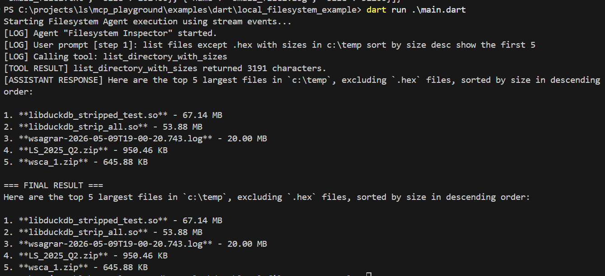
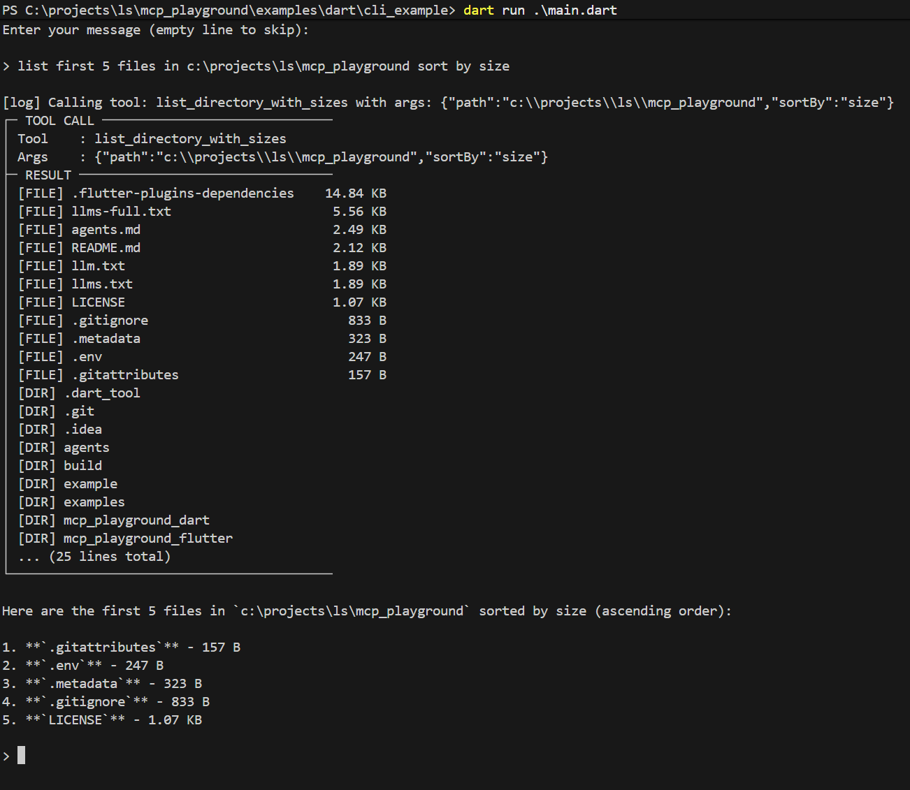

# MCP Playground Monorepo

> [!NOTE]
> This project was created and is actively maintained using agentic coding tools. The core monorepo and its packages were built with **Google Antigravity IDE** (primarily powered by **Gemini 3.5 Flash**), and specific components (such as some examples) were developed using the **ZooCode** plugin with **DeepSeek-V4**. It stands as a real-world demonstration of building production-ready Dart packages and interactive Flutter libraries using agentic workflows.

Welcome to the **MCP Playground** monorepo! This project is split into a headless pure-Dart core package and an interactive Flutter widget library to let you prototype, debug, and run agentic Model Context Protocol (MCP) workflows across any platform.

---

## 📦 Packages

| Package | Description | Directory |
|---------|-------------|-----------|
| **[`mcp_playground_dart`](mcp_playground_dart)** | Pure Dart core engine. Handles agent orchestration, LLM service adapters, MCP client transport (HTTP/SSE/stdio subprocesses), and loop execution — **no Flutter dependencies**. | [`/mcp_playground_dart`](mcp_playground_dart) |
| **[`mcp_playground_flutter`](mcp_playground_flutter)** | Fully-featured UI layer for Flutter. Provides the interactive chat interface, settings drawer, tool manager, and the side-by-side **Agent Inspector** panel. | [`/mcp_playground_flutter`](mcp_playground_flutter) |

---

## 🚀 Examples

We provide several example applications showcasing both UI and headless integrations:

### 📱 Flutter (UI-based) Examples
* **[Primary Showcase App](mcp_playground_flutter/example)**: A comprehensive Flutter application demonstrating the `McpPlayground` UI widget with custom SSH, Open-Meteo weather, and fl_chart tool integrations.
* **[Embedded LLM Showcase](examples/flutter/example_embedded)**: A Flutter application pre-configured to run with a local on-device embedded LLM (`llamadart`) with zero external network dependencies.

### 💻 Dart (Headless) Examples
* **[Skill Importer Example](examples/dart/skill_example)**: Demonstrates importing an agentskills.io-compatible [`skill.md`](examples/dart/skill_example/skill.md) with multi-turn prompts, executing a web search + HTML chart generation workflow via `McpAgentEngine`.

* **[Local Filesystem Inspector](examples/dart/local_filesystem_example)**: A headless agent configured to install and run the official `@modelcontextprotocol/server-filesystem` Node.js server via NPX to inspect and sort local files.
  
  

* **[Interactive CLI Chat Agent](examples/dart/cli_example)**: An interactive command-line interface loaded dynamically via configurations, allowing you to have a multi-turn chat conversation with LLMs using local Node/Python subprocess MCP tools.

  

* **[Embedded Model Runner](examples/dart/embedded_example)**: A pure Dart console example that downloads a `Qwen2.5-3B` GGUF model directly from Hugging Face with real-time download progress, initializes `llamadart`, registers native weather tools, and runs an offline agent with real-time token-by-token streaming.

---

## 🎥 Demo Video & Visuals
-
Watch the Flutter UI Playground executing terminal SSH tasks and charting stats:

