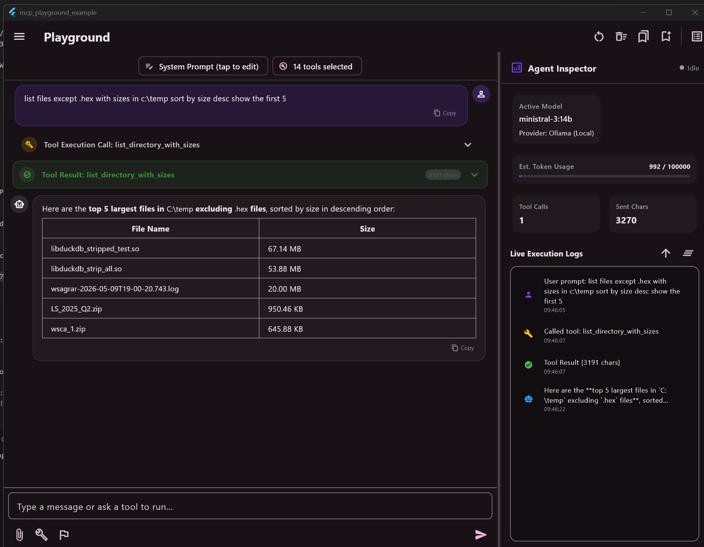

# MCP Playground Example Showcase

This directory contains a complete showcase application demonstrating how to integrate the [`mcp_playground_flutter`](https://pub.dev/packages/mcp_playground_flutter) widget into a Flutter project.

It initializes the playground widget with custom local Dart-native tools (Weather, SSH/SFTP, and Chart Generator) and registers local MCP subprocesses (`Git` and `Filesystem`) automatically.

---

## 🎨 Visual Preview

Here is how the playground and its configuration interfaces look:

### LLM Provider Setup


### Local MCP Subprocesses Setup (Desktop Mode)


### Filesystem MCP Server Integration


---

## 🚀 How to Run

1. Navigate to the `example/` directory:
   ```bash
   cd example/
   ```
2. Copy the template `.env` and fill in your provider keys and parameters:
   ```env
   LLM_PROVIDER=openai
   LLM_MODEL=gpt-4o-mini
   LLM_API_KEY=your_key_here
   ```
3. Run the application:
   ```bash
   flutter pub get
   flutter run
   ```

---

## 📦 Features Demonstrated

- **Custom Local Dart-native Tools**:
  - **Weather**: Fetch conditions and forecasts using the Open-Meteo API.
  - **SSH/SFTP**: List, read, download, upload files and execute commands.
  - **Chart Generator**:
    - **Interactive Rendering (`messageContentBuilder`)**: The `create_chart_png` tool outputs a custom JSON description of the chart. The host application intercepts this response using the `messageContentBuilder` callback parameter on the widget and renders a fully interactive chart using the `fl_chart` library.
    - **Direct PNG Generation (`chart2png`)**: The `chart2png` tool uses an offscreen canvas to rasterize the chart into raw PNG bytes, returning it as a base64-encoded image attachment so it is rendered by the playground's built-in image preview widget.
- **Local MCP Subprocesses (Subprocesses Mode)**:
  - Spawns local stdio-based MCP servers:
    - **Git** (runs `mcp-server-git` via `uvx`)
    - **Filesystem** (runs `@modelcontextprotocol/server-filesystem` via `npx` or `npm`)
- **Host Requirements for Local Subprocesses**:
  - **Node.js** (for filesystem npx actions)
  - **Python 3** & **`uv`** (for git uvx actions)
