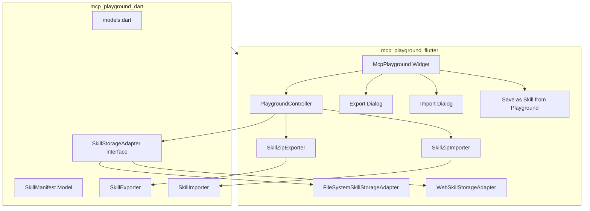
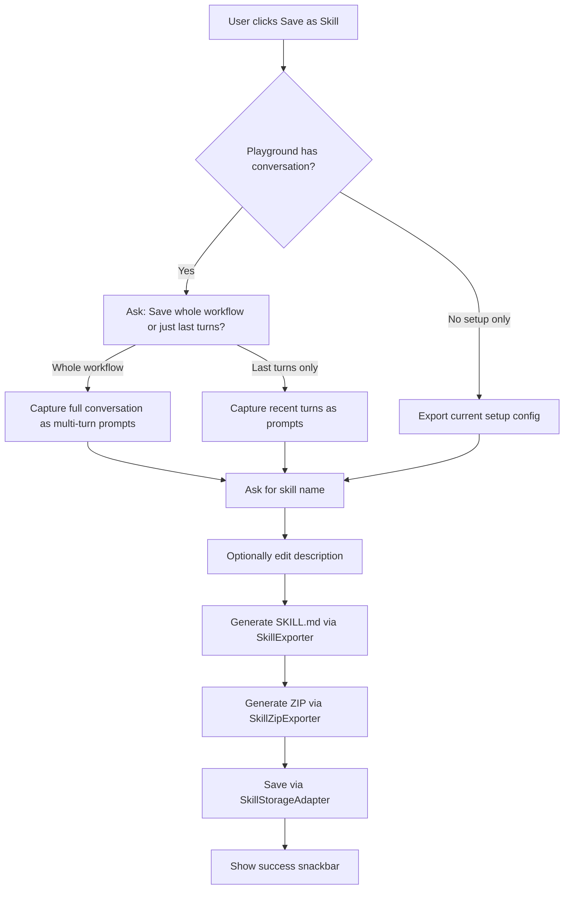
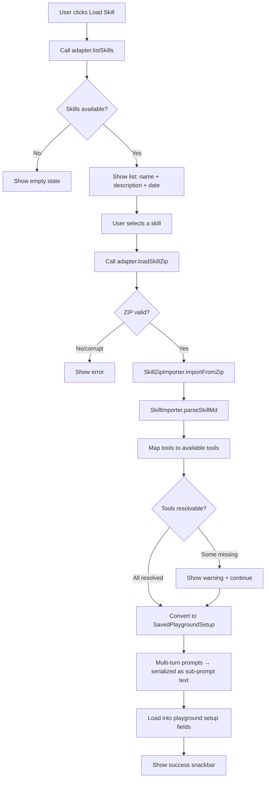

# Skills Export/Import Implementation Plan (v2)

## Overview

Rebuild the mcp_playground export system to be 100% compatible with [agentskills.io](https://agentskills.io/home) SKILL.md format. Export as ZIP archives, import from ZIP. Replace old JSON export/import entirely. Add a "Save as Skill" workflow from the playground conversation and a multi-turn skill creation wizard.

---

## Architecture Diagram



---

## Phase 1: Core Models & Adapter Interface (`mcp_playground_dart`)

### 1.1 `SkillStorageAdapter` Interface (Abstract)

File: [`mcp_playground_dart/lib/src/skills/skill_storage_adapter.dart`](mcp_playground_dart/lib/src/skills/skill_storage_adapter.dart)

This is the key abstraction. Users can implement their own adapter (e.g., database-backed) to save/load skills.

```dart
/// Info about a stored skill returned by the adapter.
class StoredSkillInfo {
  final String name;       // Display name of the skill
  final String zipFileName; // e.g. "weather-assistant.zip"
  final DateTime savedAt;
  final String? description;

  const StoredSkillInfo({
    required this.name,
    required this.zipFileName,
    required this.savedAt,
    this.description,
  });

  Map<String, dynamic> toJson() => {
    'name': name,
    'zipFileName': zipFileName,
    'savedAt': savedAt.toIso8601String(),
    if (description != null) 'description': description,
  };

  factory StoredSkillInfo.fromJson(Map<String, dynamic> json) => StoredSkillInfo(
    name: json['name'] as String,
    zipFileName: json['zipFileName'] as String,
    savedAt: DateTime.parse(json['savedAt'] as String),
    description: json['description'] as String?,
  );
}

/// Abstract adapter for persisting skill ZIP files.
/// Implementations decide where and how ZIPs are stored.
abstract class SkillStorageAdapter {
  /// Saves a skill ZIP. Returns the zipFileName used.
  Future<StoredSkillInfo> saveSkill({
    required String name,
    required String? description,
    required Uint8List zipBytes,
  });

  /// Loads a skill ZIP by its name. Returns the raw ZIP bytes.
  /// Returns null if the skill is not found or corrupt.
  Future<Uint8List?> loadSkillZip(String name);

  /// Lists all stored skills.
  Future<List<StoredSkillInfo>> listSkills();

  /// Deletes a stored skill by name.
  Future<void> deleteSkill(String name);

  /// Checks if a skill with the given name exists.
  Future<bool> skillExists(String name);
}
```

### 1.2 `SkillManifest` Model

File: [`mcp_playground_dart/lib/src/models/skill_manifest.dart`](mcp_playground_dart/lib/src/models/skill_manifest.dart)

```dart
class SkillManifest {
  final String name;
  final String description;
  final String version;
  final String? author;

  // System prompt
  final String systemPrompt;

  // Multi-step prompts with per-step tool bindings
  final List<SkillPromptStep> promptSteps;

  // Tools declared with runtime/install info for portability
  final List<SkillToolDeclaration> tools;

  // mcp_playground custom metadata
  final McpPlaygroundSkillMetadata? mcpPlaygroundMeta;

  // Whether this skill represents a multi-turn workflow
  final bool isMultiTurn;
}

class SkillPromptStep {
  final String text;
  final List<String>? enabledToolNames;  // null = all tools
  final bool stopAfterToolCall;
}

class SkillToolDeclaration {
  final String name;
  final String? description;
  final Map<String, dynamic>? inputSchema;

  // Portability tier: "external" | "local" | "capability"
  final String tier;

  final String? runtime;      // "python" | "nodejs" | "dart"
  final String? installCmd;   // "pip install ..." | "npm install ..." | "npx ..." | "uvx ..."
  final String? registryUrl;  // For external MCP servers
  final String? capability;   // For generic capability (e.g., "weather_retrieval")
}

class McpPlaygroundSkillMetadata {
  final bool chatMode;
  final bool stopAfterToolCall;
  final bool useCustomLlm;
  final Map<String, dynamic>? customLlmConfig;
  final Map<String, dynamic>? mcpInitParams;
  final DateTime createdAt;
  final bool isMultiTurn;
}
```

### 1.3 `skills_path` Property

Add to `McpPlaygroundStorageDelegate` (for the default file-system adapter):

```dart
/// Sets the root directory for skill ZIP storage (desktop/mobile only).
Future<void> saveSkillsRootPath(String path);

/// Gets the root directory for skill ZIP storage.
Future<String?> loadSkillsRootPath();
```

Note: The web adapter uses browser storage internally and does not use `skills_path`.

### 1.4 Model Exports

Update [`mcp_playground_dart/lib/mcp_playground_dart.dart`](mcp_playground_dart/lib/mcp_playground_dart.dart):
- Export `skill_manifest.dart` and `skill_storage_adapter.dart`

---

## Phase 2: SKILL.md Generator & Parser (`mcp_playground_dart`)

### 2.1 SKILL.md Format Specification

The SKILL.md file uses YAML frontmatter delimited by `---`, followed by markdown body.

**Single-turn example:**
```markdown
---
name: weather-assistant
description: Get weather forecasts for any city using Open-Meteo
version: 1.0.0
author: mcp_playground
system_prompt: |
  You are a weather assistant. Use available tools to provide accurate forecasts.
  Present data clearly with units.

prompts:
  - text: What is the weather like in Vienna today?
    tools: [get_current_weather, geocode_weather_city]
    stop_after_tool_call: true
  - text: Now give me the hourly forecast
    tools: [get_hourly_forecast]

tools:
  - name: get_current_weather
    description: Get current weather conditions
    runtime: dart
    capability: weather_retrieval
    input_schema:
      type: object
      properties:
        latitude: {type: number}
        longitude: {type: number}
      required: [latitude, longitude]

  - name: filesystem_read
    description: Read files from the local filesystem
    runtime: nodejs
    install: npx @modelcontextprotocol/server-filesystem

mcp_playground:
  chat_mode: false
  stop_after_tool_call: false
  is_multi_turn: false
  created_at: "2026-07-14T18:00:00Z"
---

# Weather Assistant

Provides weather forecasts using Open-Meteo (free, no API key needed).
```

**Multi-turn example** (conversation history preserved as sub-prompts):
```markdown
---
name: research-workflow
description: A multi-step research workflow that gathers data and creates charts
version: 1.0.0
author: mcp_playground
system_prompt: |
  You are a research assistant. Gather data systematically, then visualize.

prompts:
  - text: Find the population of Vienna, Berlin, and Paris
    tools: [web_search]
    stop_after_tool_call: true
  - text: Using the population data from the previous step, create a bar chart
    tools: [create_chart_png]
    stop_after_tool_call: false

tools:
  - name: web_search
    description: Search the web for information
    runtime: nodejs
    install: npx @anthropic/mcp-server-brave-search

  - name: create_chart_png
    description: Generate a PNG chart from data
    runtime: dart
    capability: chart_generation

mcp_playground:
  chat_mode: false
  is_multi_turn: true
  created_at: "2026-07-14T18:00:00Z"
---

# Research Workflow

Multi-step workflow: web search → data visualization.
```

### 2.2 Tool → SKILL.md Mapping Rules

| Source | Tier | Runtime | Install Field |
|--------|------|---------|---------------|
| Dart `McpLocalTool` | `capability` | `dart` | `capability: <name>` |
| Python MCP (`localType: python`) | `local` | `python` | `install: pip install ...` or `uvx ...` |
| Node.js MCP (`localType: nodejs`) | `local` | `nodejs` | `install: npm install ...` or `npx ...` |
| Remote HTTP/SSE | `external` | — | `registry: https://...` |

Capability names are derived from the tool category (e.g., `weather_retrieval`, `chart_generation`, `ssh_execution`, `filesystem_access`).

### 2.3 `SkillExporter` Class

File: [`mcp_playground_dart/lib/src/skills/skill_exporter.dart`](mcp_playground_dart/lib/src/skills/skill_exporter.dart)

```dart
class SkillExporter {
  /// Converts a SavedPlaygroundSetup + tool metadata to SkillManifest.
  SkillManifest fromSetup(
    SavedPlaygroundSetup setup, {
    required List<McpServerConfig> servers,
    required List<McpLocalTool> localTools,
    required bool isMultiTurn,
  });

  /// Converts conversation history (List of ChatMessage) to SkillManifest.
  /// Each user→assistant pair becomes a prompt step.
  SkillManifest fromConversation({
    required String name,
    required String description,
    required String systemPrompt,
    required List<ChatMessage> conversation,
    required List<McpServerConfig> servers,
    required List<McpLocalTool> localTools,
    required Set<String> enabledToolNames,
  });

  /// Generates SKILL.md content string from a SkillManifest.
  String toSkillMd(SkillManifest manifest);

  /// Generates body markdown after YAML frontmatter.
  String toSkillBody(SkillManifest manifest);
}
```

### 2.4 `SkillImporter` Class

File: [`mcp_playground_dart/lib/src/skills/skill_importer.dart`](mcp_playground_dart/lib/src/skills/skill_importer.dart)

```dart
class SkillImporter {
  /// Parses SKILL.md content into a SkillManifest.
  SkillManifest parseSkillMd(String content);

  /// Converts SkillManifest to SavedPlaygroundSetup.
  /// Filters tools to only those available in the current environment.
  SavedPlaygroundSetup toSetup(
    SkillManifest manifest, {
    required Set<String> availableToolNames,
  });

  /// Returns tool names from the manifest that are not available locally.
  List<String> getUnresolvableTools(
    SkillManifest manifest,
    Set<String> availableToolNames,
  );
}
```

---

## Phase 3: ZIP Export/Import + Adapter Implementations (`mcp_playground_flutter`)

### 3.1 New Dependency

Add to [`mcp_playground_flutter/pubspec.yaml`](mcp_playground_flutter/pubspec.yaml):
```yaml
dependencies:
  archive: ^4.0.2
```

### 3.2 `SkillZipExporter`

File: [`mcp_playground_flutter/lib/src/skills/skill_zip_exporter.dart`](mcp_playground_flutter/lib/src/skills/skill_zip_exporter.dart)

```dart
class SkillZipExporter {
  /// Creates a ZIP archive containing SKILL.md and optional extra files.
  /// Returns the raw ZIP bytes (not a file path — storage is handled by adapter).
  Future<Uint8List> exportToZip({
    required SkillManifest manifest,
    Map<String, Uint8List>? extraFiles,
  });
}
```

ZIP internal structure:
```
skill-name/
├── SKILL.md
└── [optional: scripts/, resources/, etc.]
```

### 3.3 `SkillZipImporter`

File: [`mcp_playground_flutter/lib/src/skills/skill_zip_importer.dart`](mcp_playground_flutter/lib/src/skills/skill_zip_importer.dart)

```dart
class SkillZipImporter {
  /// Extracts SKILL.md from ZIP bytes and returns parsed SkillManifest.
  /// Also returns any extra files found in the ZIP.
  ({SkillManifest manifest, Map<String, Uint8List> extraFiles}) importFromZip(
    Uint8List zipBytes,
  );
}
```

### 3.4 `FileSystemSkillStorageAdapter` (Desktop/Mobile)

File: [`mcp_playground_flutter/lib/src/skills/file_system_skill_storage_adapter.dart`](mcp_playground_flutter/lib/src/skills/file_system_skill_storage_adapter.dart)

```dart
class FileSystemSkillStorageAdapter implements SkillStorageAdapter {
  final String rootPath;

  const FileSystemSkillStorageAdapter({required this.rootPath});

  @override
  Future<StoredSkillInfo> saveSkill({...}) async {
    // 1. Sanitize name → zipFileName (e.g., "weather-assistant.zip")
    // 2. Write zipBytes to rootPath/zipFileName
    // 3. Update skills-defs.json in rootPath
    // 4. Return StoredSkillInfo
  }

  @override
  Future<Uint8List?> loadSkillZip(String name) async {
    // 1. Look up zipFileName from skills-defs.json
    // 2. Read rootPath/zipFileName
    // 3. Return bytes (or null if missing/corrupt)
  }

  @override
  Future<List<StoredSkillInfo>> listSkills() async {
    // Read and parse skills-defs.json
  }

  @override
  Future<void> deleteSkill(String name) async {
    // Remove from skills-defs.json and delete ZIP file
  }

  @override
  Future<bool> skillExists(String name) async { ... }
}
```

The `skills-defs.json` format:
```json
[
  {
    "name": "weather-assistant",
    "zipFileName": "weather-assistant.zip",
    "savedAt": "2026-07-14T18:00:00Z",
    "description": "Get weather forecasts for any city"
  }
]
```

### 3.5 `WebSkillStorageAdapter` (Web)

File: [`mcp_playground_flutter/lib/src/skills/web_skill_storage_adapter.dart`](mcp_playground_flutter/lib/src/skills/web_skill_storage_adapter.dart)

```dart
class WebSkillStorageAdapter implements SkillStorageAdapter {
  // Uses IndexedDB (via dart:indexed_db or universal_io abstraction)
  // Stores skills-defs as a JSON key, each skill ZIP as a separate key

  @override
  Future<StoredSkillInfo> saveSkill({...}) async { ... }

  @override
  Future<Uint8List?> loadSkillZip(String name) async { ... }

  @override
  Future<List<StoredSkillInfo>> listSkills() async { ... }

  @override
  Future<void> deleteSkill(String name) async { ... }

  @override
  Future<bool> skillExists(String name) async { ... }
}
```

### 3.6 Adapter Selection in `PlaygroundController`

The `PlaygroundController` holds a `SkillStorageAdapter` reference. It auto-selects based on platform:

```dart
class PlaygroundController extends ChangeNotifier {
  // ...
  SkillStorageAdapter? _skillStorage;

  SkillStorageAdapter get skillStorage {
    if (_skillStorage != null) return _skillStorage!;

    if (kIsWeb) {
      _skillStorage = WebSkillStorageAdapter();
    } else {
      final rootPath = /* load from storage delegate */;
      _skillStorage = FileSystemSkillStorageAdapter(rootPath: rootPath);
    }
    return _skillStorage!;
  }

  /// Allows users to inject a custom adapter (e.g., DB-backed).
  void setSkillStorageAdapter(SkillStorageAdapter adapter) {
    _skillStorage = adapter;
  }
}
```

---

## Phase 4: UI Updates (`mcp_playground_flutter`)

### 4.1 Remove Old JSON Export/Import

In [`mcp_playground_flutter/lib/mcp_playground.dart`](mcp_playground_flutter/lib/mcp_playground.dart):

- **Remove** methods: `_exportSetups()`, `_importSetups()`, `_showImportMissingToolsWarning()`
- **Remove** UI triggers for those methods

### 4.2 New Buttons

| Label | Icon | Action |
|-------|------|--------|
| "Save as Skill" | `Icons.bookmark_add_outlined` | Opens save-as-skill dialog (from playground) |
| "Load Skill" | `Icons.bookmarks_outlined` | Opens import/load dialog |

### 4.3 Save as Skill Dialog Flow



### 4.4 Import/Load Skill Dialog Flow



### 4.5 Multi-turn → Sub-prompt Conversion

When a skill with multiple `prompts` is imported, each prompt step is serialized into the `initialPrompt` field using the existing `serializeSubPromptSteps()` format:

```
First prompt text
++#++[NT:tool1|tool2][SATC]
Second prompt text with ${tool_result}
++#++[NT:tool3]
Third prompt text
```

This ensures imported multi-turn skills are immediately usable as sub-prompt chains.

---

## Phase 5: Config Adaptation

### 5.1 Add `description` to `SavedPlaygroundSetup`

In [`mcp_playground_dart/lib/src/models/models.dart`](mcp_playground_dart/lib/src/models/models.dart):

```dart
class SavedPlaygroundSetup {
  // ... existing fields ...
  final String description;  // NEW (optional, defaults to "")

  SavedPlaygroundSetup({
    // ... existing params ...
    this.description = '',
  });
}
```

Update `toJson()`, `fromJson()`, and `copyWith()` accordingly.

### 5.2 Field Mapping (Complete)

| SavedPlaygroundSetup | SKILL.md YAML | Direction |
|---------------------|---------------|-----------|
| `name` | `name` | ↔ |
| `description` | `description` | ↔ |
| — | `version` | → (always "1.0.0" on export, ignored on import) |
| — | `author` | → (always "mcp_playground" on export) |
| `systemPrompt` | `system_prompt` | ↔ |
| `initialPrompt` (serialized) | `prompts[]` | ↔ (parsed/serialized as sub-prompts) |
| `enabledToolNames` | `prompts[].tools` | ↔ |
| `stopAfterToolCall` | `prompts[].stop_after_tool_call` | ↔ |
| — | `tools[]` | → (generated from server/local tool metadata) |
| `chatMode` | `mcp_playground.chat_mode` | ↔ |
| `useCustomLlm` | `mcp_playground.use_custom_llm` | ↔ |
| `customLlmConfig` | `mcp_playground.custom_llm_config` | ↔ |
| `mcpInitParams` | `mcp_playground.mcp_init_params` | ↔ |
| `createdAt` | `mcp_playground.created_at` | ↔ |
| — | `mcp_playground.is_multi_turn` | ↔ |

---

## Phase 6: "Save as Skill" from Playground Workflow

### 6.1 Conversation Capture

When the user has been conversing in the playground, clicking "Save as Skill" presents two options:

1. **"Save whole workflow"** — Captures the entire conversation history as multi-turn prompts. Each user→assistant exchange becomes a `SkillPromptStep`.

2. **"Save last turns only"** — Captures only the most recent N turns (or single prompt), creating a simpler skill.

### 6.2 Conversion Logic

In `PlaygroundController`:

```dart
/// Converts the current conversation to a SkillManifest for export.
Future<SkillManifest> exportConversationAsSkill({
  required String name,
  required String description,
  required bool wholeWorkflow,
  required int? lastNTurns,  // only used if wholeWorkflow=false
}) async {
  final messages = wholeWorkflow
      ? _messages.toList()
      : _getLastNTurns(lastNTurns ?? 1);

  return SkillExporter().fromConversation(
    name: name,
    description: description,
    systemPrompt: _systemPrompt,
    conversation: messages,
    servers: _servers,
    localTools: _localTools,
    enabledToolNames: _enabledToolNames,
  );
}
```

### 6.3 Auto-Generate Name & Description

When saving from conversation, offer an "Auto-generate" button that uses the LLM to produce a skill name, description, and system prompt based on the conversation context. The user can then edit before saving.

---

## Phase 7: File Structure Summary

### New Files

```
mcp_playground_dart/lib/src/
├── models/
│   └── skill_manifest.dart              [NEW]
├── skills/
│   ├── skill_storage_adapter.dart       [NEW] Interface + StoredSkillInfo
│   ├── skill_exporter.dart              [NEW]
│   └── skill_importer.dart              [NEW]

mcp_playground_flutter/lib/src/
├── skills/
│   ├── skill_zip_exporter.dart          [NEW]
│   ├── skill_zip_importer.dart          [NEW]
│   ├── file_system_skill_storage_adapter.dart  [NEW]
│   └── web_skill_storage_adapter.dart   [NEW]
└── widgets/
    └── skill_save_dialog.dart           [NEW] Save-as-skill dialog
```

### Modified Files

```
mcp_playground_dart/lib/
├── mcp_playground_dart.dart             Export new modules
└── src/models/models.dart               Add description to SavedPlaygroundSetup

mcp_playground_flutter/lib/
├── mcp_playground.dart                  Remove JSON export/import, add Save/Load Skill buttons
├── playground_controller.dart           Add skillStorage, exportConversationAsSkill
└── pubspec.yaml                         Add archive dependency
```

---

## Key Constraints

1. **Vanilla Flutter state management** — no Riverpod/Bloc
2. **Minimal dependencies** — only `archive` ^4.0.2 added
3. **Cross-platform**: `FileSystemSkillStorageAdapter` for desktop/mobile, `WebSkillStorageAdapter` for web
4. **Pluggable storage**: `SkillStorageAdapter` interface allows custom implementations (DB, cloud, etc.)
5. **Preserve existing**: `SavedPlaygroundSetup` and agents list remain intact internally
6. **Portability tiers**: Capability-based for Dart tools, runtime/install for local MCP, registry URL for external
7. **Multi-turn support**: SKILL.md `prompts[]` array handles multi-step workflows natively
